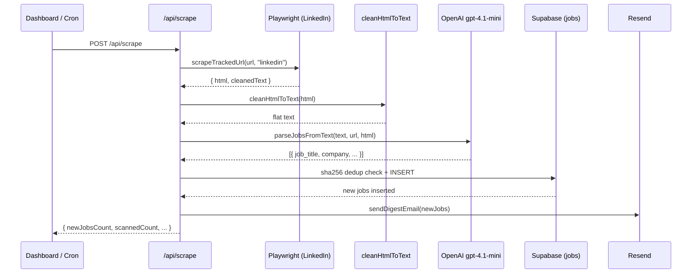

# Reactive Job Post Notifier

Single-user full-stack job tracker for LinkedIn and company career pages.

## Architecture

- **Frontend:** React 18 + Vite + TypeScript + Tailwind (`src/`)
- **Backend:** Vercel Serverless Functions (`api/`)
- **Shared utilities:** `lib/` (scraping, parsing, dedup, email)
- **Shared types:** `shared/types.ts` (frontend + backend), `lib/types.ts` (backend-only)
- **Database:** Supabase Postgres (`supabase/schema.sql`)
- **Scheduling:** GitHub Actions cron → `POST /api/scrape` with `CRON_SECRET`

## Key Flows

1. Tracked URLs stored in Supabase; hourly scrape hits each URL.
2. Playwright for LinkedIn, Cheerio + fetch for static pages.
3. Cleaned text → OpenAI (gpt-4.1-mini) → structured job fields.
4. Dedup via `sha256(job_title + company_name + job_url)`.
5. New jobs → batched Resend digest email.

## Commands

- `npm run dev` — start Vite dev server (frontend only)
- `vercel dev` — local dev with serverless API routes
- `npm run build` — TypeScript check + Vite production build
- `npm run typecheck` — `tsc -b --noEmit`
- `npm run lint` / `npm run lint:fix` — ESLint
- `npm run format` / `npm run format:check` — Prettier

## Scrape Pipeline Flow

## Conventions

- TypeScript strict mode; shared types in `shared/types.ts`.
- API routes are Vercel serverless handlers in `api/`.
- Environment variables listed in README; use `.env` locally.
- No Vercel cron on Hobby plan; scheduling is external via GitHub Actions.
- Scraping delay configurable via `SCRAPE_DELAY_MS` (2s–7s range).
